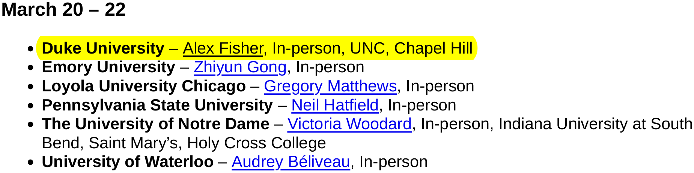
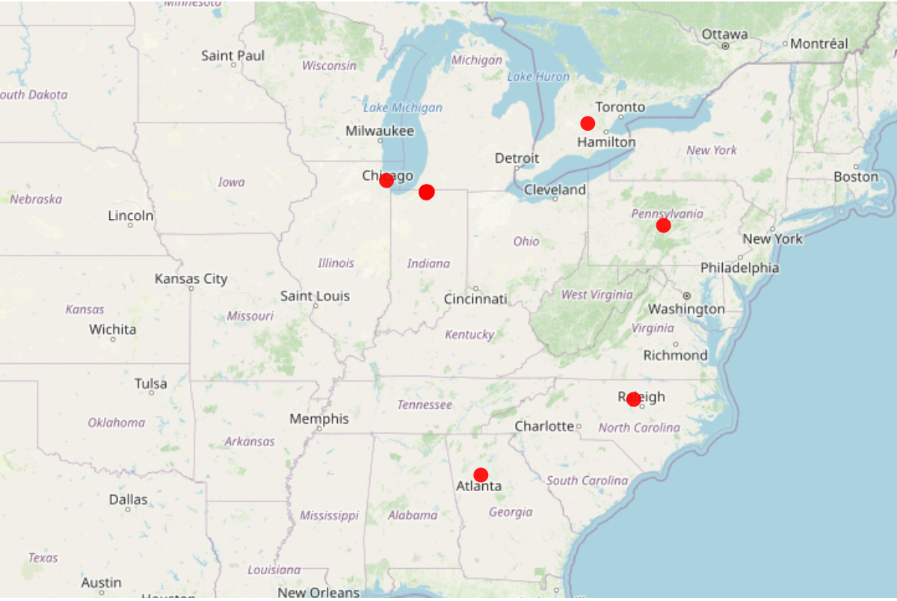
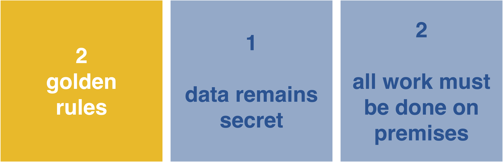

<!-- ##  -->

<!-- <iframe width="1313" height="739" src="https://www.youtube.com/embed/5oG0UAHRWOk" title="ASA DataFest 2022 @dukeuniversity" frameborder="0" allow="accelerometer; autoplay; clipboard-write; encrypted-media; gyroscope; picture-in-picture; web-share" allowfullscreen> -->

<!-- </iframe> -->

## Stats

-   137 Participants

. . .

-   37 teams

. . .

-   4 award categories

. . .

-   1 surprise data set

## This weekend

{fig-align="center" width="750"}
{fig-align="center" width="550"}
```{r}
#| eval: false
#| echo: false

library(leaflet)
library(dplyr)

schools <- data.frame(
  name = c(
    "Duke University",
    "Emory University",
    "Loyola University Chicago",
    "Pennsylvania State University",
    "University of Notre Dame",
    "Indiana University South Bend",
    "Saint Mary's College",
    "Holy Cross College",
    "University of Waterloo"
  ),
  lat = c(
    36.0014,
    33.7925,
    42.0016,
    40.7982,
    41.7056,
    41.6656,
    41.7075,
    41.6987,
    43.4723
  ),
  lon = c(
    -78.9382,
    -84.3266,
    -87.6573,
    -77.8599,
    -86.2380,
    -86.2510,
    -86.2540,
    -86.2565,
    -80.5449
  )
)

leaflet(schools) %>%
  addTiles() %>%
  addCircleMarkers(
    lng = ~lon,
    lat = ~lat,
    radius = 6,
    color = "red",
    stroke = FALSE,
    fillOpacity = 0.9,
    popup = ~name,
    label = ~name
  ) %>%
  fitBounds(
    lng1 = min(schools$lon),
    lat1 = min(schools$lat),
    lng2 = max(schools$lon),
    lat2 = max(schools$lat)
  )
```


## The \#1 Rule {.center}

### data remains secret

- do not share any *information* about the data set (the source, features, etc.) outside of this event (e.g. no public GitHub repos, etc.) prior to **May 2**. 

 - do not input or upload any portion of the data into any generative AI platform or chatbot
 
 
<!-- {fig-align="center" width="800"} -->

## Presentations {.smaller}

-   Upload presentations by noon (12:00PM) on Sunday
-   Check slack for room assignment
-   First round presentations start at 1pm
-   Second (final) round presentations start at 3pm
    -   Same presentation as before
    -   All are welcome!
-   4 minutes (sharp!) + up to 4 minute Q&A
-   3 content slides **max** (+ cover slide with team name if preferred) - PDF/powerpoint formats only.

## Winning categories

**Four categories in no particular order!**

-   Best Insight
-   Best Use of Outside Data or Best Statistical Analysis
-   Best Visualization
-   Judge's Pick

::: callout-note
## Advice

Run your ideas by the consultants to see which might be the best fit for your project, have a back up category in mind.
:::

## Data distribution {.smaller}

Two methods:

1.  If using the RStudio/Jupyter containers, data will appear magically for you, find credentials to log-in at check-in counter!

2.  If not, download from the link pinned in slack (link will only be available for a short time after kickoff)

-   **Read the proprietary statement!**

-   Advice \# 1: Working with large data can be tricky, if you don't have your own tricks up your sleeves, ask/look for advice on working with large data

- Advice \#2: Stick around, this is wear the food and help is!

::: callout-important
## Reminder
-   Data can only be used for DataFest and should not be shared with anyone outside of DataFest or posted publicly
:::

## wifi

-   If Duke, use what you usually use
-   `DukeVisitor` works otherwise

## Schedule of events

- [https://dukestatsci.github.io/datafest/schedule.html](https://dukestatsci.github.io/datafest/schedule.html)

## Questions?

Find the organizers near the check-in area or flag down any consultant/staff (in the white shirts)

## What's next?

Tonight:

-   Check-in if you haven't already
-   Enjoy dinner!
-   9:00PM consulting ends & DataFest closes

See the schedule for the most up-to-date info about the event: <https://dukestatsci.github.io/datafest/schedule.html>

## Thank you, [sponsors](https://dukestatsci.github.io/datafest/sponsors.html)!

{fig-align="center"}

# Meet the data!
