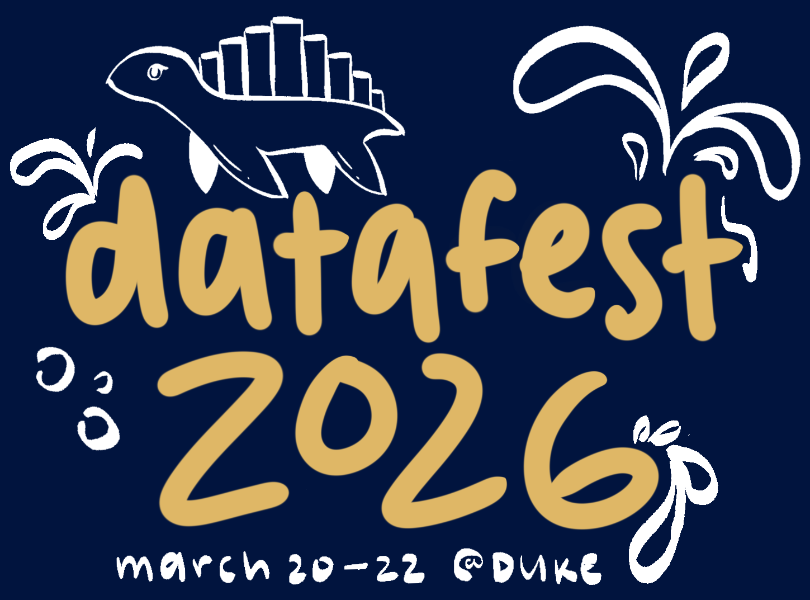
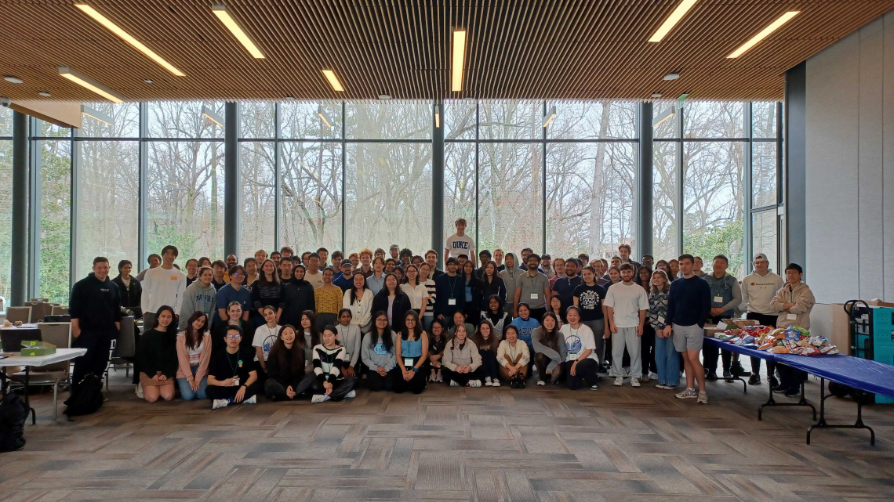
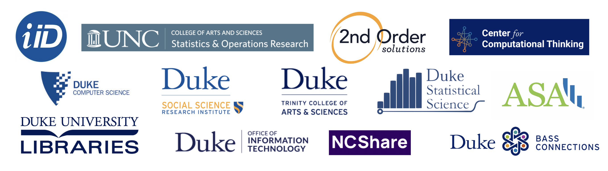

---
format:
  html:
    css: styles.css
---

  

<a href="#event-details" class="scroll-indicator" aria-label="Scroll to event details">
  
</a>

<section id="home">
</section>

## Event details

**When:** Friday, March 20 at 5:00pm - Sunday, March 22 at 5:00pm

**Where:** Perkins Library, Duke University

<!-- :::callout-important -->
<!-- ## Sign up now -->

<!-- [Click here](/signup.html) to sign-up for DataFest 2026! -->
<!-- ::: -->

DataFest begins with a Friday welcome where you’ll be introduced to a surprise, real-world dataset and the organization behind it. Over the weekend, teams will explore the data, develop a research question, and conduct their own analysis.

Projects are due Sunday afternoon. Teams will present their findings to a panel of faculty and industry judges, with prizes awarded for categories such as best visualization, best use of external data, and best overall insights.

## What is DataFest?

::: callout
[Click here](https://stat.duke.edu/news/students-put-classroom-skills-practice-duke-datafest-2024) to read a news article published in Duke Daily about the 2024 winners! [Click here](https://www.youtube.com/watch?v=5oG0UAHRWOk) to watch a highlight video from a previous DataFest!
:::

ASA DataFest<small>TM</small> is a data analysis competition where teams of up to five students attack a large, complex, and surprise data set over a weekend. Your job is to represent your school by finding and communicating insights into these data. The teams that impress the judges will win prizes as well as glory for their school. Everyone will have a great experience, lots of food, and fun!

ASA DataFest<small>TM</small> is also a great opportunity to gain experience that employers are looking for. Having worked on a data analysis problem at this scale will certainly help make you a good candidate for any position that involves analysis and critical thinking, and it will provide a concrete example to demonstrate your experience during interviews.

ASA DataFest<small>TM</small> at Duke is organized by the Department of Statistical Science and the Statistical Science Majors Union (SSMU) at Duke University.

<!-- <a href="about.html" class="btn btn-primary"> -->
<!--   Click here for more details about DataFest!  -->
<!-- </a> -->

  

  

<!-- SPONSORS -->

## [Sponsors](sponsors.html)

  <!-- Full-width sponsor image -->
  

